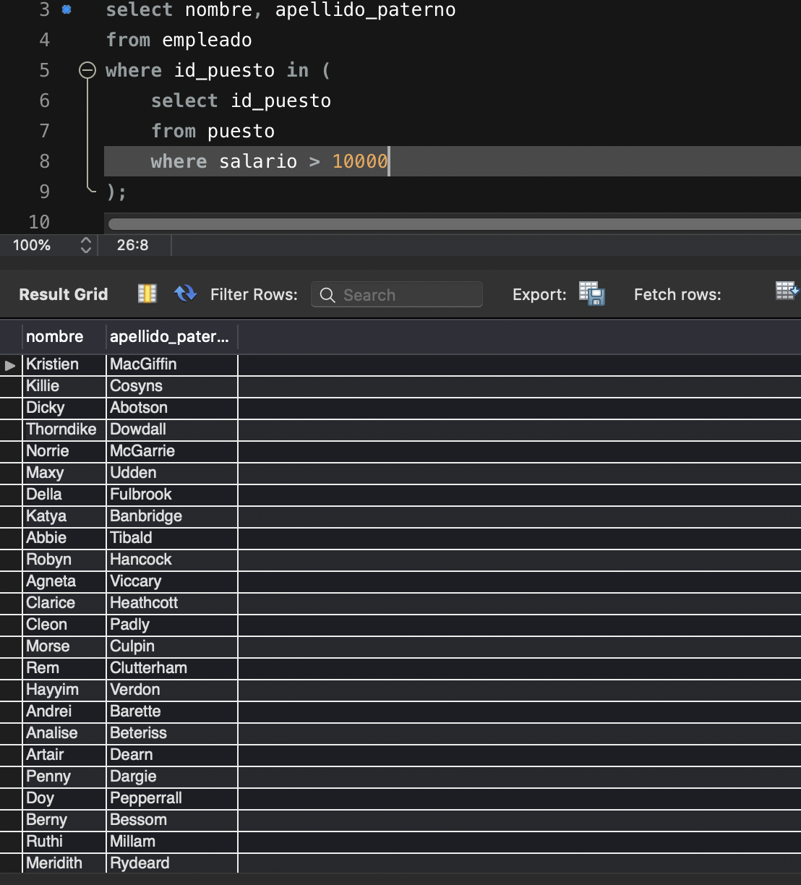
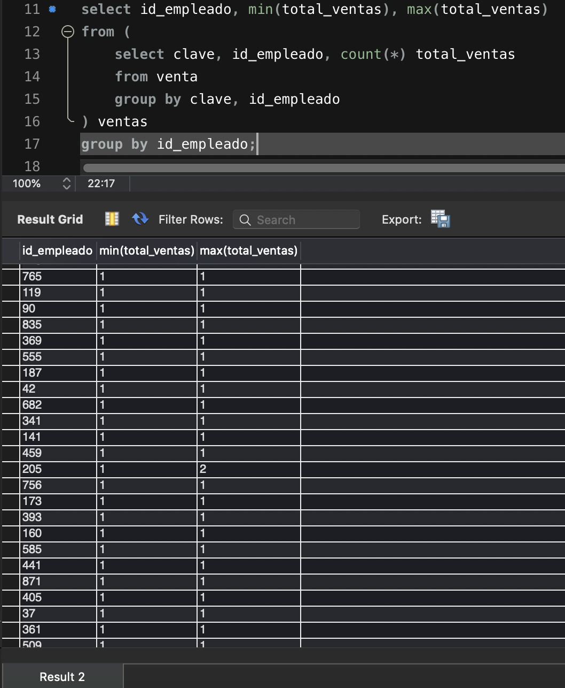
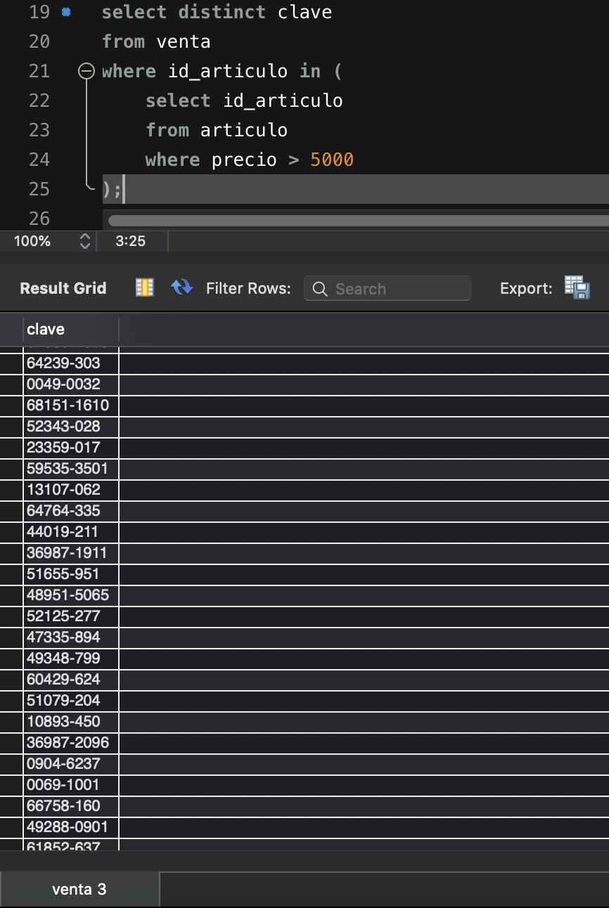
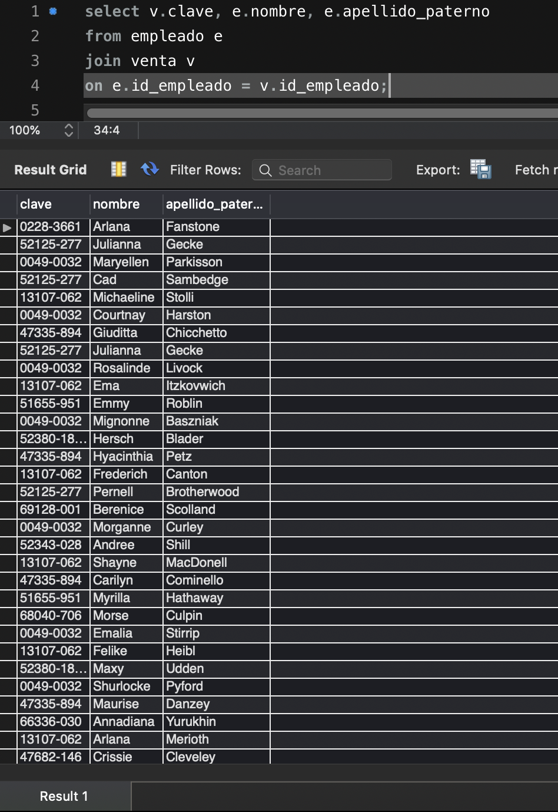
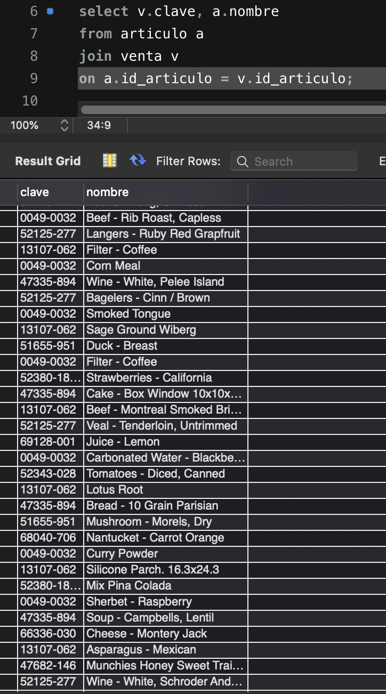
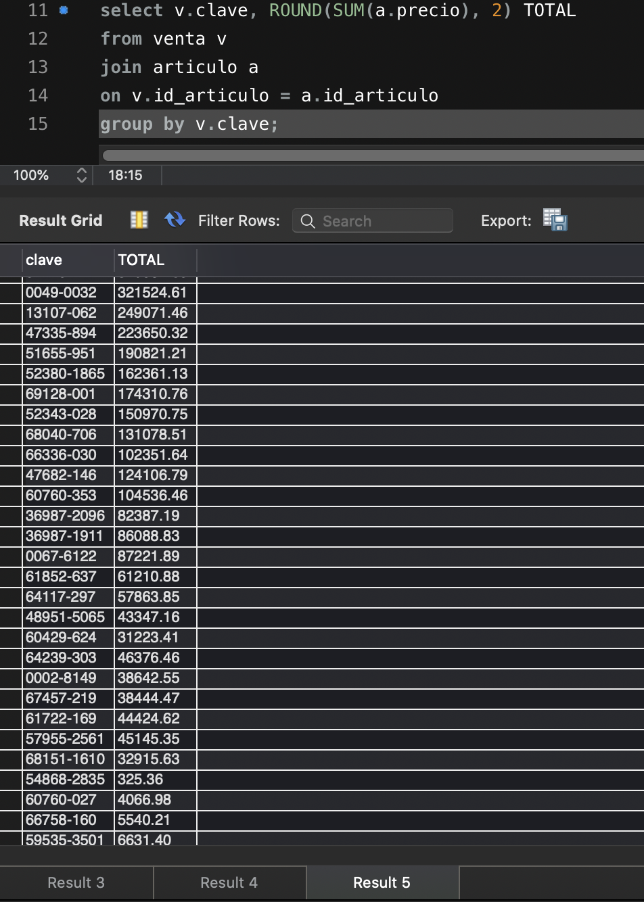
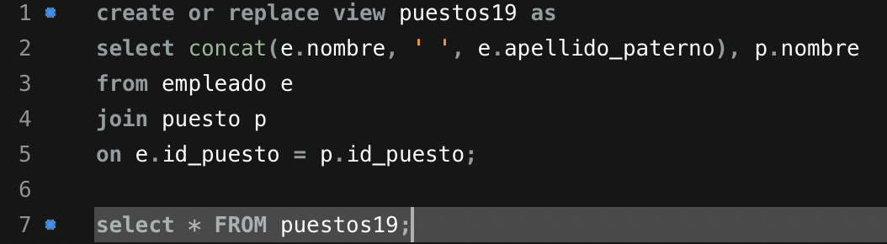
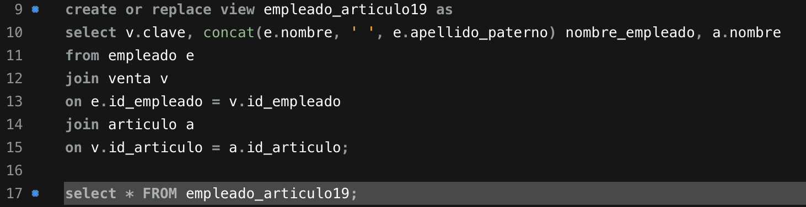
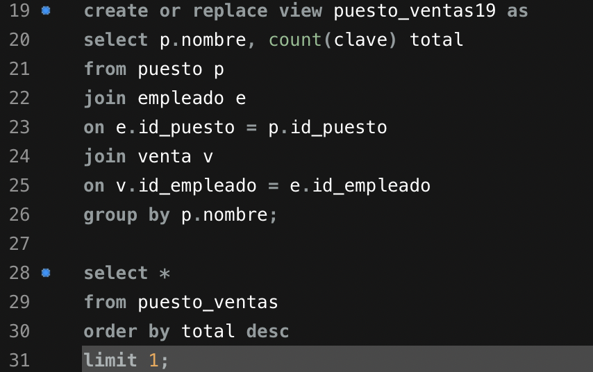

# Retos Sesión 3 Solucionados

## Reto 1

- ¿Qué artículos incluyen la palabra Pasta en su nombre?

- ¿Qué artículos incluyen la palabra Cannelloni en su nombre?

- ¿Qué nombres están separados por un guión (-) por ejemplo Puree - Kiwi?

- ¿Qué puestos incluyen la palabra Designer?

- ¿Qué puestos incluyen la palabra Developer?

## Reto 2

- ¿Cuál es el promedio de salario de los puestos?

- ¿Cuántos artículos incluyen la palabra Pasta en su nombre?

- ¿Cuál es el salario mínimo y máximo?

- ¿Cuál es la suma del salario de los últimos cinco puestos agregados?

## Reto 3

- ¿Cuántos registros hay por cada uno de los puestos?

- ¿Cuánto dinero se paga en total por puesto?

- ¿Cuál es el número total de ventas por vendedor?

- ¿Cuál es el número total de ventas por artículo?

