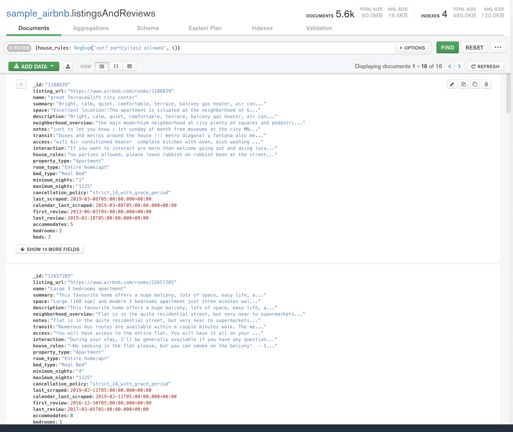
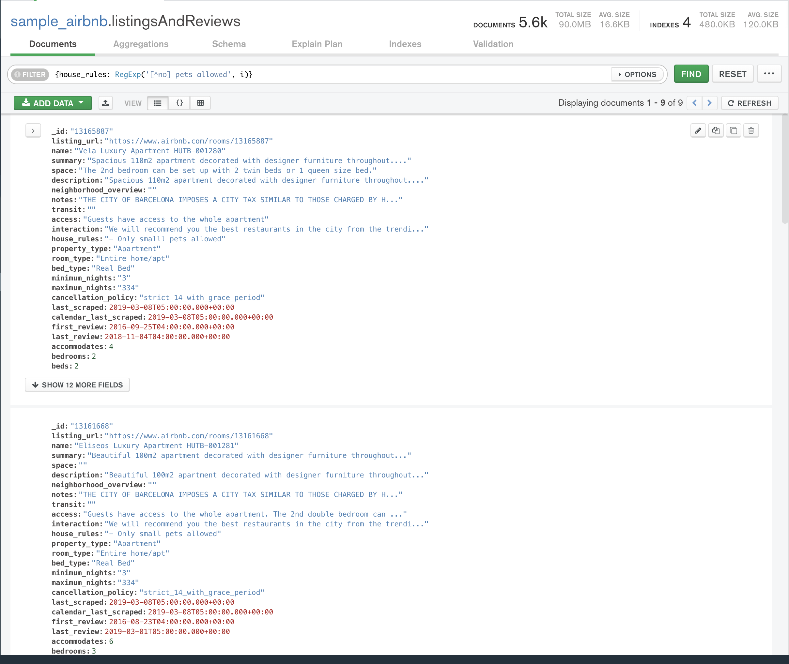
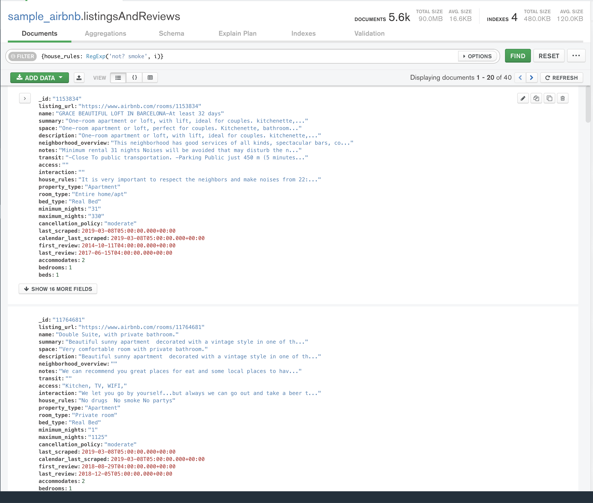
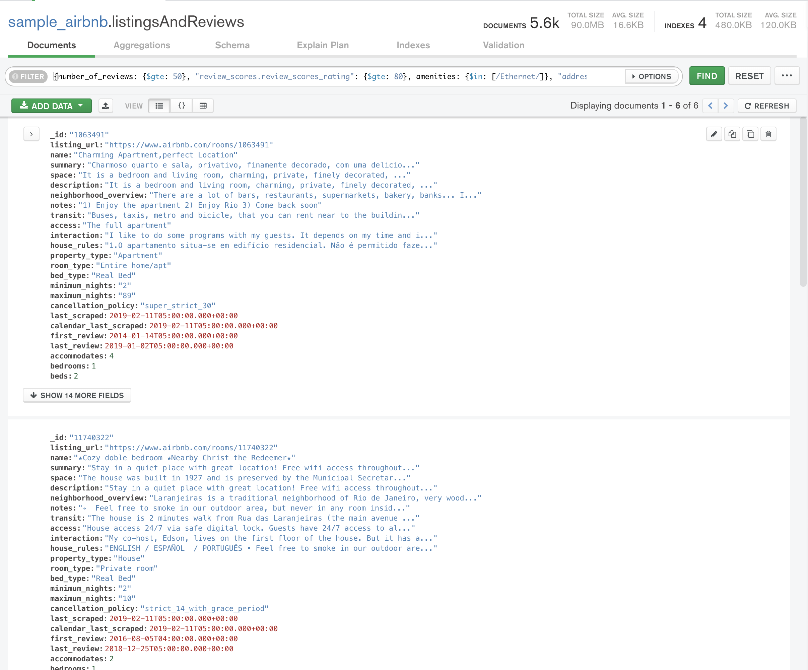
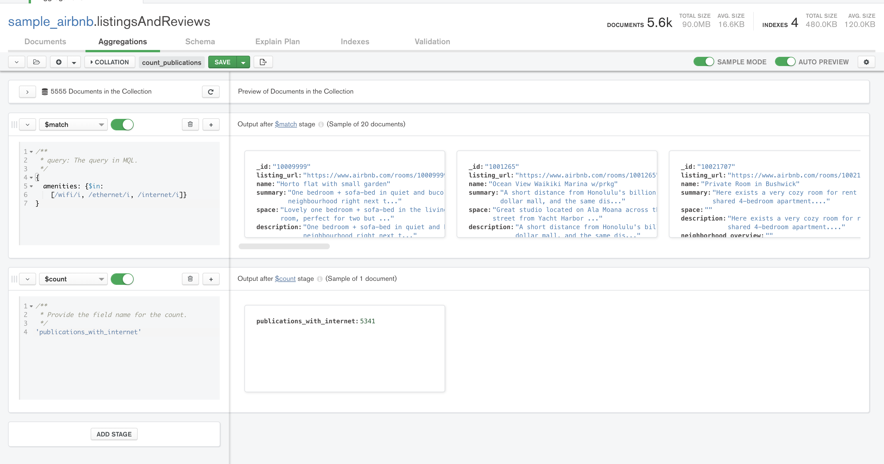

# Retos Sesión 3 Solucionados

## Reto 1

- ¿Cuál es el nombre de los empleados cuyo sueldo es mayor a $100,000?

- ¿Cuál es la cantidad mínima y máxima de ventas de cada empleado?

- ¿Cuáles claves de venta incluyen artículos cuyos precios son mayores a $5,000?

## Reto 2

- ¿Cuál es el nombre de los empleados que realizaron cada venta?

- ¿Cuál es el nombre de los artículos que se han vendido?

- ¿Cuál es el total de cada venta?

## Reto 3

- Obtener el puesto de un empleado.

- Saber qué artículos ha vendido cada empleado.

- Saber qué puesto ha tenido más ventas.

