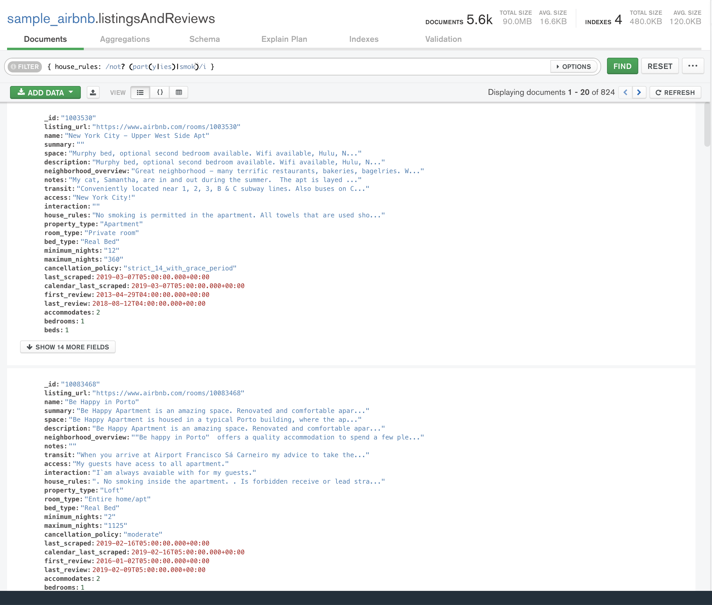

# Retos Sesión 5 Solucionados

## Reto 1: Expresiones Regulares

- Propiedades que no permiten fiestas.

```json
{
  "filter": {
    "house_rules": RegExp("not? part(y|ies) allowed", i)
  }
}
```


- Propiedades que admiten mascotas.

```json
{
  "filter": {
    "house_rules": RegExp("[^no] pets allowed", i)
  }
}
```


- Propiedades que no permiten fumadores.

```json
{
  "filter": {
    "house_rules": RegExp("not? smoke", i)
  }
}
```


- Propiedades que no perimitan fiestas ni fumadores.

```json
{
  "filter": {
    "house_rules": RegExp("not? (part(y|ies)|smok)", i)
  }
}
```



## Reto 2: Notación punto y arreglos

- Usando la colección `sample_airbnb.listingsAndReviews`, agrega un filtro que permita obtener todas las publicaciones que tengan 50 o más comentarios, que la valoración sea mayor o igual a 80, que cuenten con conexión a Internet vía cable y estén ubicados en Brazil.

```json
{
  "filter": {
    "number_of_reviews": {
      "$gte": 50
    },
    "review_scores.review_scores_rating": {
      "$gte": 80
    },
    "amenities": {
      "$in": [
        RegExp("Ethernet")
      ]
    },
    "address.country_code": "BR"
  }
}
```


## Reto 3: Introducción a las agregaciones

- Usando la colección `sample_airbnb.listingsAndReviews`, mediante el uso de agregaciones, encontrar el número de publicaciones que tienen conexión a Internet sea desde Wifi o desde cable (Ethernet).

```json
[
  {
    "$match": {
      "amenities": {
        "$in": [
          new RegExp('wifi', 'i'), new RegExp('ethernet', 'i'), new RegExp('internet', 'i')
        ]
      }
    }
  }, {
    "$count": "publications_with_internet"
  }
]
```

