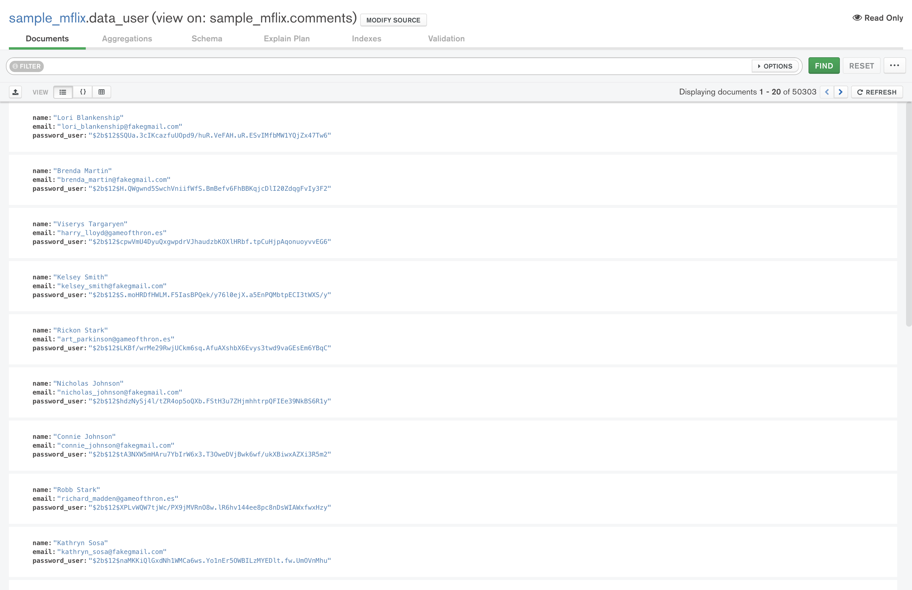

# Retos Sesión 6 Solucionados

## Reto 1

Con base en el ejemplo 1, modifica el agrupamiento para que muestre el costo promedio por habitación por país de las propiedades de tipo casa.

```json
[
  {
    "$match": {
      "property_type": "House", 
      "bedrooms": {
        "$gte": 1
      }
    }
  }, {
    "$addFields": {
      "costo_recamara": {
        "$divide": [
          "$price", "$bedrooms"
        ]
      }
    }
  }, {
    "$group": {
      "_id": "$address.country", 
      "avg_cost": {
        "$avg": "$costo_recamara"
      }
    }
  }
]
```


## Reto 2

Usando las colecciones comments y users, se requiere conocer el correo y contraseña de cada persona que realizó un comentario. Construye un pipeline que genere como resultado estos datos.

```json
[
  {
    "$lookup": {
      "from": "users", 
      "localField": "email", 
      "foreignField": "email", 
      "as": "usuario"
    }
  }, {
    "$addFields": {
      "user_object": {
        "$arrayElemAt": [
          "$usuario", 0
        ]
      }
    }
  }, {
    "$addFields": {
      "password_user": "$user_object.password"
    }
  }, {
    "$project": {
      "_id": 0, 
      "name": 1, 
      "email": 1, 
      "password_user": 1
    }
  }
]
```


## Reto 3

1. Usando el pipeline que generaste en el Reto 2, genera la vista correspondiente.



- Para finalizar, elimina todas las vistas que generaste durante esta sesión. En la siguiente sesión, aprenderás a tener tu propio servidor para generar tus propias vistas.

** En mi caso no elimine la vista ya que estaba utilizando una base de datos local **
